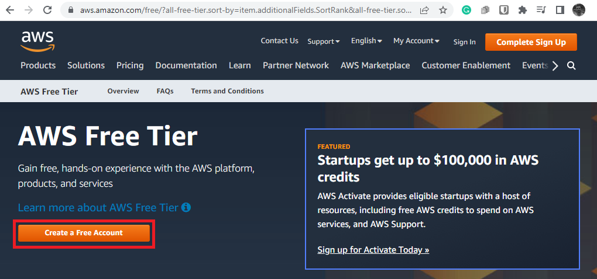
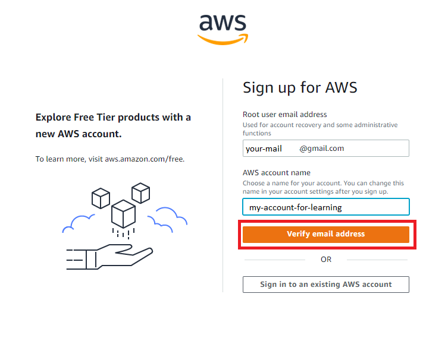
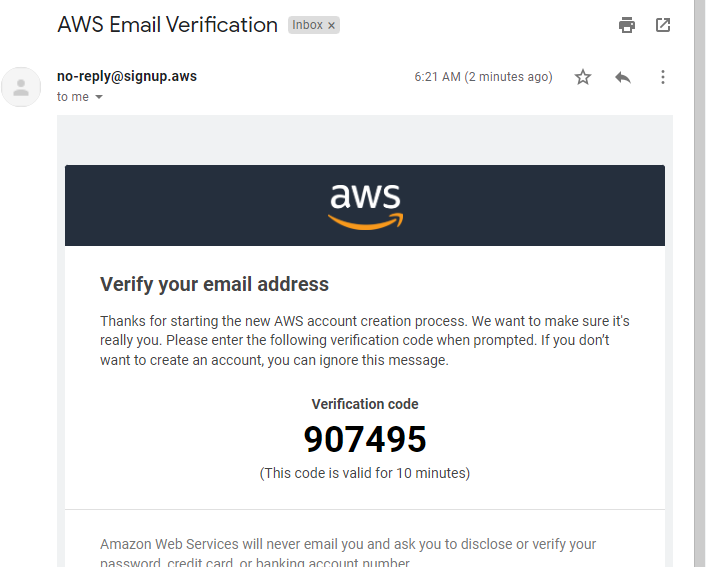
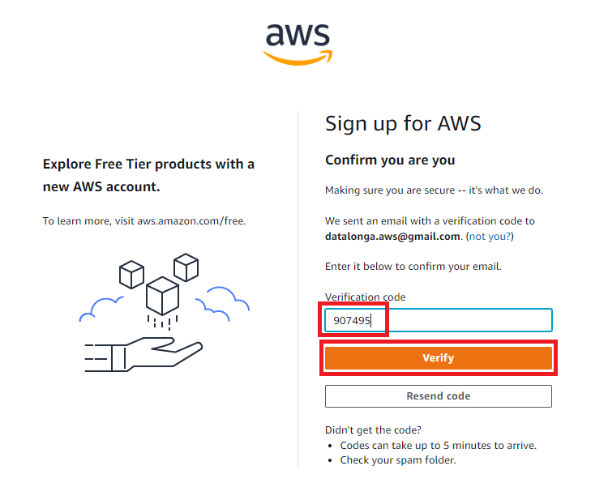
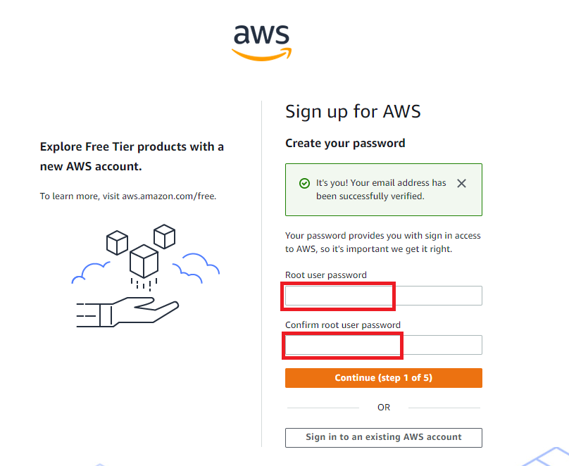
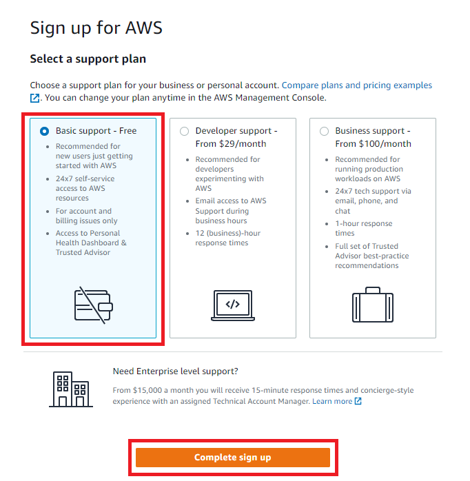
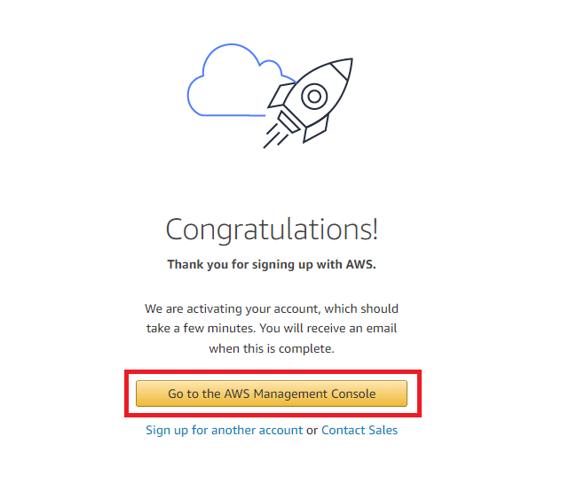

# Create AWS Account

## 1. Search for free tier
- AWS provides some services free within some limits in one year.
- Open borwser and search **aws free tier**

## 2. Create a Free Account

--------------------

## 3. Verify e-mail address
- You need a new e-mail address. AWS doesn't allow previously used e-mails.
- Replace your own mail. Not necessarily be gmail any mail service ok.
- Give a name for your account.

-------------------

## 4. Verification code
- Open your mailbox.

-------------------

## 5. Enter verification code
- Go back aws account creation page.
- Enter the code.

---------------------

## 6. Specify a password

-----------------

## 7. Contact Information
- Fill contact information

## 8. Billing Information
- For credit card, a digital card is suggested.

## 9. Confirm your identity

## 10. Enter sms code

## 11. Select free plan

---------------------

## 12. Congratulations

----------------------

