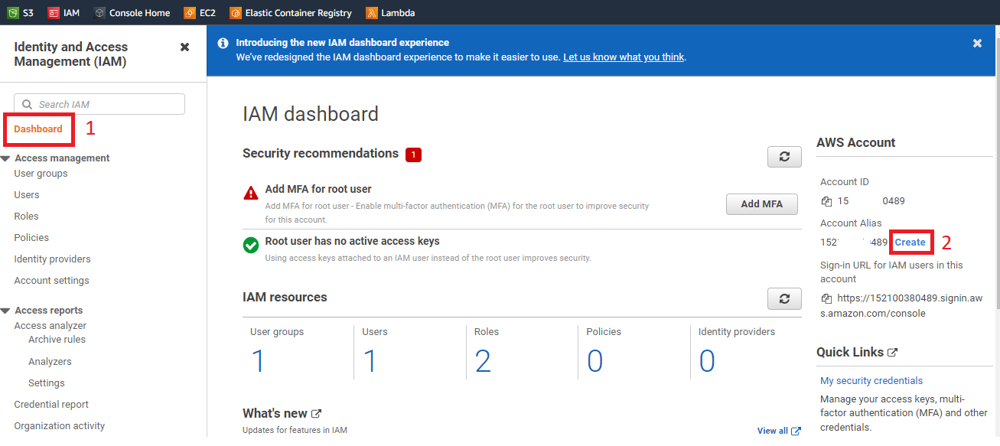
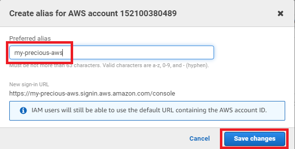
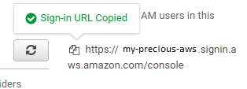
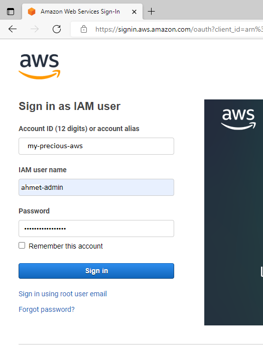

# Create Account Alias

- It is difficult to remember Account ID. Usually we create an alias for this id and use it for login url.

## 1. Create alias

------------------------

----------------------

## 2. Login with alias

### 2.1. Copy alias console url

-----------------------

### 2.2. Open different browser
- For example edge or firefox
- Paste copied alias url

-------------------------
