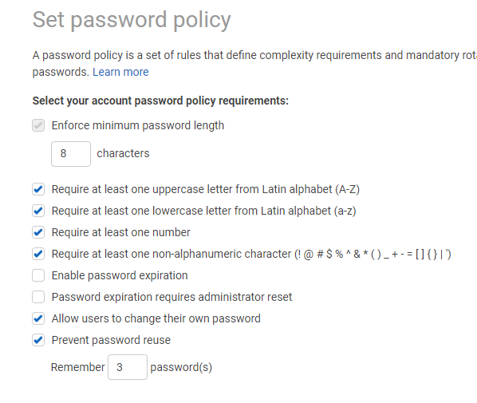

# MFA and Password Policies

## 1. Set password policies

------------------------

----------------------

## 2. Enable MFA for root account
### 2.1. Login with root account
- Right top corner

-----------------

--------------------

-----------------------

### 2.2. (Phone) Install a compatible app on your mobile device or computer
- Mac: Authy
- Android: Google Authenticator or Authy

### 2.3. (Phone) Open app

### 2.4. Click Show QR

### 2.5. (Phone) Scan QR with the app

### 2.6. Enter consequetive 2 code 

------------------

--------------------

---------------------

## 3. Test MFA
### 3.1. Logout

### 3.2. Login with root email

### 3.3. Enter password

### 3.4. Enter MFA code

## 4. Do the same for admin iam user
