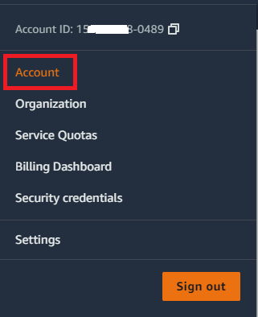
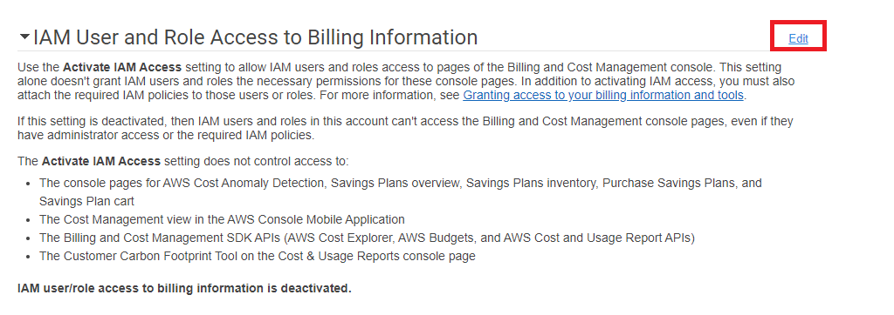
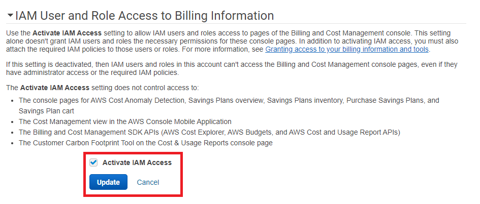
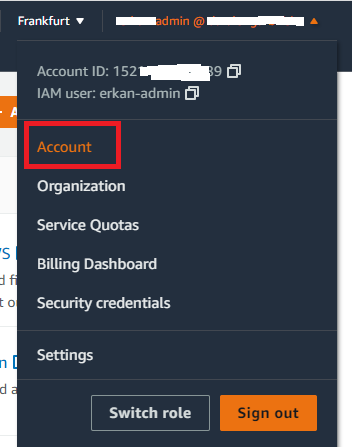
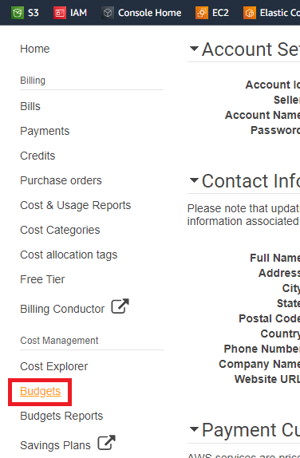
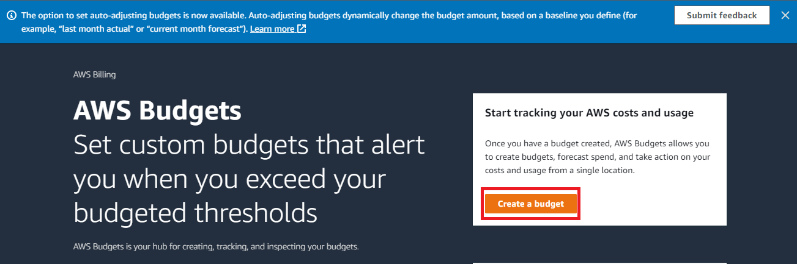
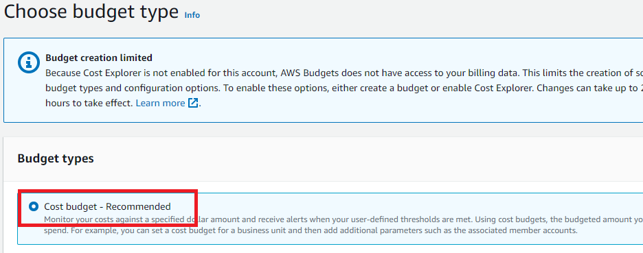
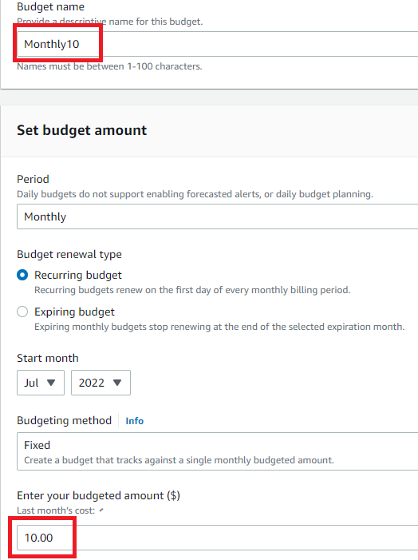
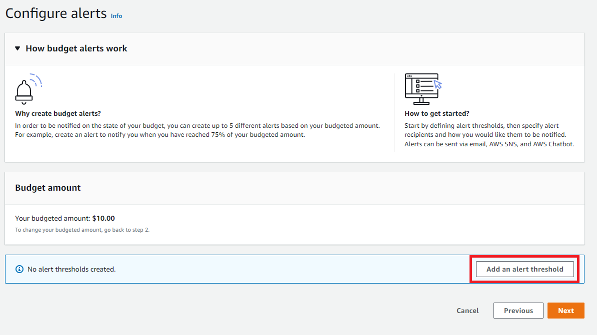
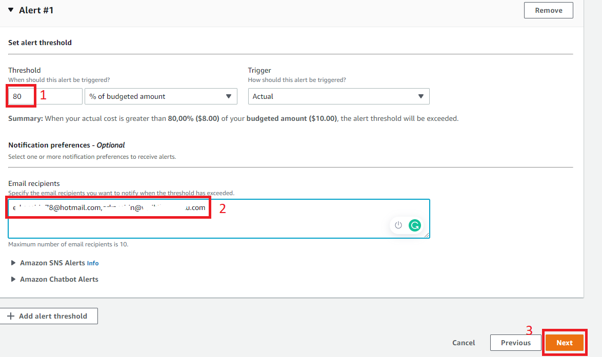

## 1. Login root account

## 2. Giving billing permission to admin iam user
### 2.1. Open Account

------------------------

### 2.2. Edit iam user billing information 

--------------------------

--------------------------

## 2.3. logout

## 3. Login admin iam use account

### 3.1. Open Account

--------------------

--------------------

-------------------

-------------------

- Budget name: Monthly10
- Enter your budgeted amount ($): 10

Leave rest of the options as they are.

----------------------

---------------------

-----------------------

## 3.2 Next

## 3.3. Create Budget
